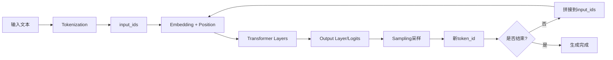
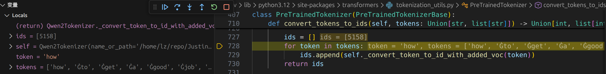

# LLM 推理原理深度剖析 —— 以 Qwen3-0.6B 为例

不知道大家有没有考虑一个问题，不管是通过 API 访问，还是通过 vLLM、SGLang、llama.cpp 等本地部署，总是会出现**相同的输入，导不同的输出**的情况。纵使我们的采样参数如 `temperature`、`top_k`、`top_p` 等保持一致，还是会存在输出不一致的情况。为了探究该原因，我们以 Qwen3-0.6B 为例，做一个深度剖析！

---

## 1. 模型文件结构

```bash
~/models/Qwen3-0.6B$ tree
.
├── config.json                 # 模型结构配置（隐藏维度、层数、rope、heads 等）
├── configuration.json          # HF 元信息（框架/任务/是否 remote code）
├── generation_config.json      # 文本生成默认参数（影响输出一致性的关键！）
├── LICENSE                     # 许可证
├── merges.txt                  # BPE merges 规则（字节对合并顺序）
├── model.safetensors           # 主模型权重 (~1.4GB)
├── README.md                   # 模型说明
├── tokenizer_config.json       # tokenizer 的 meta 信息（bos/eos、padding 等）
├── tokenizer.json              # Tokenizer 主配置信息（vocab + merges + special tokens）
└── vocab.json                  # BPE vocab 词表
```

### 生成配置 (generation_config.json) 关键

```json
{
    "do_sample": true,         // 启用随机采样 —— 这是输出不一致的根本原因！
    "temperature": 0.6,        // 温度参数
    "top_k": 20,               // Top-K 采样
    "top_p": 0.95,             // Top-P 采样
    "bos_token_id": 151643,
    "eos_token_id": [151645, 151643],
    "pad_token_id": 151643
}
```

> **核心**：当你调用 `model.generate()` 时，如果不显式指定参数，transformers 会自动读取这个配置文件。Qwen3的配置文件 默认 `do_sample: true`，这意味着**每次生成都会随机采样**，导致输出不同！

### 模型核心配置 (config.json)

```json
{
  "hidden_size": 1024,           // 隐藏层维度
  "intermediate_size": 3072,     // FFN中间层维度
  "num_hidden_layers": 28,       // Transformer层数
  "num_attention_heads": 16,     // 注意力头数
  "num_key_value_heads": 8,      // KV头数 (GQA)
  "head_dim": 128,               // 每个头的维度
  "vocab_size": 151936,          // 词表大小
  "max_position_embeddings": 40960,  // 最大位置
  "rope_theta": 1000000,         // RoPE基数
  "hidden_act": "silu"           // 激活函数
}
```

---

## 2. Next-Token-Prediction 完整流程

LLM 的核心任务就是 **Next-Token-Prediction（下一个词预测）**，给定输入序列，预测下一个最可能的 token。

### 流程概览



---

## Step 1: Tokenization（分词）

将输入文本转换为模型可处理的 Token IDs。

```python
from transformers import Qwen3ForCausalLM, Qwen2Tokenizer

model_path = "path/to/Qwen3-0.6B"
tokenizer = Qwen2Tokenizer.from_pretrained(model_path, trust_remote_code=True, use_fast=True)

input_text = "how to get a good job?"
inputs = tokenizer(input_text, return_tensors="pt")
tokens = tokenizer.convert_ids_to_tokens(inputs["input_ids"][0])

for tid, token in zip(inputs["input_ids"][0].tolist(), tokens):
    print(f"Token ID: {tid}, Token: {token}")
# 关于tokenizer的具体计算逻辑，建议大家自行debug，查看里面的函数，核心就是将token——>id,id——>token 本质是hash lookup
type(tokenizer.encoder)
<class 'dict'>

(bfs) $ cat Qwen3-0.6B/tokenizer.json | grep 5158
      "how": 5158,
```



**输出结果：**

```
Token ID: 5158, Token: how
Token ID: 311,  Token: Ġto      # Ġ 表示空格前缀
Token ID: 633,  Token: Ġget
Token ID: 264,  Token: Ġa
Token ID: 1661, Token: Ġgood
Token ID: 2618, Token: Ġjob
Token ID: 30,   Token: ?
```

- 使用 **BPE (Byte-Pair Encoding)** 算法
- `Ġ` 符号表示该 token 前有空格
- 词表大小为 151,936 个 token

---

## Step 2: Embedding（嵌入）

将离散的 Token ID 转换为连续的稠密向量。

```python
# Embedding 层本质是一个查表操作
embed_layer = model.model.embed_tokens
# embed_layer.weight.shape = [151936, 1024]

embeddings = embed_layer(inputs["input_ids"])
# embeddings.shape = [1, 7, 1024]  # [batch, seq_len, hidden_size]
```

**计算过程：**

```
Token ID: 5158 (how) → 查找 embedding_matrix[5158] → 得到 1024 维向量
Token ID: 311  (to)  → 查找 embedding_matrix[311]  → 得到 1024 维向量
...
```

**示例输出：**

```
Token 'how' (ID: 5158):
  向量维度: 1024
  前5维: [0.0234, -0.0156, 0.0312, -0.0078, 0.0195]
  L2范数: 3.2456
```

---

## Step 3: Position Encoding（位置编码）

Qwen3 使用 **RoPE (Rotary Position Embedding)** 旋转位置编码。

### RoPE 原理

与传统位置编码不同，RoPE 不是将位置信息加到 embedding 上，而是在计算注意力时，对 Q、K 向量进行旋转：

```
对于位置 p 和维度对 (2i, 2i+1):

[cos(p·θᵢ)  -sin(p·θᵢ)] [q₂ᵢ  ]   [q'₂ᵢ  ]
[sin(p·θᵢ)   cos(p·θᵢ)] [q₂ᵢ₊₁] = [q'₂ᵢ₊₁]

其中 θᵢ = 1 / (θ^(2i/d)), θ = 1,000,000 (Qwen3的base)
```

**RoPE 的优势：**
1. **相对位置感知**：位置信息编码在 Q·K 的内积中
2. **外推性**：可处理比训练时更长的序列
3. **计算高效**：仅需要额外的旋转操作

---

## Step 4: Transformer Layers（核心计算）

Qwen3-0.6B 有 28 层 Transformer，每层包含：

```
Input
  │
  ├── RMSNorm ──────────────────────────────┐
  │         │                               │
  │    Self-Attention                       │ 残差连接
  │         │                               │
  │ ────────┴───────────────────────────────┤
  │                                         │
  ├── RMSNorm ──────────────────────────────┤
  │         │                               │
  │    FFN (SwiGLU)                         │ 残差连接
  │         │                               │
  └─────────┴───────────────────────────────┘
                     │
                  Output
```

### A. Self-Attention（自注意力机制）

```python
# 线性变换得到 Q, K, V
Q = W_q @ x   # [batch, seq, hidden] → [batch, seq, num_heads * head_dim]
K = W_k @ x   # [batch, seq, hidden] → [batch, seq, num_kv_heads * head_dim]
V = W_v @ x   # [batch, seq, hidden] → [batch, seq, num_kv_heads * head_dim]

# 应用 RoPE
Q, K = apply_rope(Q, K, position_ids)

# 计算注意力分数
attn_scores = Q @ K.T / sqrt(head_dim)  # [batch, heads, seq, seq]
attn_weights = softmax(attn_scores)

# 加权求和
output = attn_weights @ V
output = W_o @ output  # 输出投影
```

**Qwen3 使用 GQA (Grouped Query Attention)：**
- 16 个 Query 头
- 8 个 KV 头
- 每 2 个 Query 头共享 1 个 KV 头
- 减少 KV Cache，提升推理效率

**注意力矩阵示例：**

```
         how    to   get     a  good   job     ?
how    0.453 0.123 0.089 0.102 0.078 0.089 0.066
to     0.234 0.312 0.134 0.098 0.078 0.088 0.056
get    0.189 0.223 0.278 0.112 0.089 0.067 0.042
a      0.156 0.178 0.189 0.234 0.112 0.078 0.053
good   0.134 0.156 0.167 0.178 0.245 0.078 0.042
job    0.123 0.134 0.145 0.156 0.189 0.178 0.075
?      0.112 0.123 0.134 0.145 0.156 0.167 0.163
```

### B. FFN (SwiGLU)

```python
# SwiGLU 激活函数
gate = silu(W_gate @ x)     # 门控信号
up = W_up @ x               # 上投影
intermediate = gate * up    # 逐元素相乘
output = W_down @ intermediate  # 下投影

# 维度变化
# [batch, seq, 1024] → [batch, seq, 3072] → [batch, seq, 1024]
```

---

## Step 5: Output Layer（输出层）

```python
# 最终 RMSNorm
hidden_states = rms_norm(hidden_states)

# LM Head: 映射到词表维度
logits = lm_head(hidden_states)  # [batch, seq, hidden] → [batch, seq, vocab_size]
# logits.shape = [1, 7, 151936]

# Softmax 得到概率分布
probs = softmax(logits / temperature)
```

**每个位置的预测示例：**

```
位置 6 (当前token: '?') → 预测下一个token:
  1. ' I'        ████████████████░░░░░░░░░░░░  12.34%
  2. '\n'        ████████████░░░░░░░░░░░░░░░░   9.87%
  3. ' Here'     ██████████░░░░░░░░░░░░░░░░░░   8.56%
  4. ' Getting'  ████████░░░░░░░░░░░░░░░░░░░░   6.78%
  5. ' There'    ██████░░░░░░░░░░░░░░░░░░░░░░   5.43%
```

---

## Step 6: Autoregressive Generation（自回归生成）

LLM 通过循环生成 token：

```python
for step in range(max_new_tokens):
    # 1. Forward pass
    outputs = model(input_ids)
    next_token_logits = outputs.logits[:, -1, :]
    
    # 2. 采样策略
    probs = softmax(next_token_logits / temperature)
    next_token_id = sample(probs)  # greedy / top-k / top-p / ...
    
    # 3. 拼接到输入
    input_ids = concat(input_ids, next_token_id)
    
    # 4. 检查 EOS
    if next_token_id == eos_token_id:
        break
```

---

## 3. 影响输出一致性的因素

### 3.1 `do_sample` —— 随机性的开关

**这是最关键的参数！** 决定了是使用确定性解码还是随机采样：

| `do_sample` | 行为 | 一致性 |
|-------------|------|--------|
| False | 使用 torch.argmax() 选择概率最高的 token | **确定性** |
| True | 使用 torch.multinomial() 按概率分布随机采样 | **随机** |

**transformers 源码实现** (`generation/utils.py`):

```python
# token selection
if do_sample:
    probs = nn.functional.softmax(next_token_scores, dim=-1)
    next_tokens = torch.multinomial(probs, num_samples=1).squeeze(1)  # 随机抽样
else:
    next_tokens = torch.argmax(next_token_scores, dim=-1)  # 确定性
```

### 3.2 采样策略详解

当 `do_sample=True` 时，会依次应用以下策略处理 logits：

| 策略 | 描述 | 一致性 |
|-----|------|--------|
| **Greedy** | 始终选概率最高的 token (do_sample=False) | 确定性 |
| **Temperature** | 调整概率分布锐度 | T→0 趋近确定，T>0 随机 |
| **Top-K** | 只保留前 K 个 token | 随机 |
| **Top-P (Nucleus)** | 保留累积概率达 P 的最小集合 | 随机 |

#### 完整采样流程

```
模型输出 logits
     │
     ▼
┌─────────────────────────────────────┐
│  1. Temperature 缩放                │
│     scores = logits / temperature   │
└─────────────────────────────────────┘
     │
     ▼
┌─────────────────────────────────────┐
│  2. Top-K 过滤                      │
│     保留前 K 大的，其余设为 -inf     │
└─────────────────────────────────────┘
     │
     ▼
┌─────────────────────────────────────┐
│  3. Top-P 过滤                      │
│     保留累积概率 ≤ P 的 token       │
└─────────────────────────────────────┘
     │
     ▼
┌─────────────────────────────────────┐
│  4. Softmax 转换为概率分布            │
│     probs = softmax(scores)         │
└─────────────────────────────────────┘
     │
     ▼
┌─────────────────────────────────────┐
│  5. 采样                             │
│  if do_sample:                      │
│      torch.multinomial(probs)       │
│  else:                              │
│      torch.argmax(probs)            │
└─────────────────────────────────────┘
     │
     ▼
  下一个 token
```

#### Temperature 实现 (transformers 源码)

```python
# transformers/generation/logits_process.py - TemperatureLogitsWarper
def __call__(self, input_ids, scores):
    scores_processed = scores / self.temperature
    return scores_processed
```

**效果：**
- `T < 1`：分布更"尖锐"，概率集中在高分 token
- `T = 1`：保持原始分布
- `T > 1`：分布更"平坦"，低分 token 获得更多机会

```
# 示例：T=0.1 时 Top-3
#   'I': 89.2%, 'Here': 5.4%, '\n': 3.2%
# 示例：T=2.0 时 Top-3
#   'I': 15.6%, 'Here': 12.3%, '\n': 11.8%
```

#### Top-K 实现 (transformers 源码)

```python
# transformers/generation/logits_process.py - TopKLogitsWarper
def __call__(self, input_ids, scores):
    top_k = min(self.top_k, scores.size(-1))
    # 小于第 K 大值的 token 设为 -inf
    indices_to_remove = scores < torch.topk(scores, top_k)[0][..., -1, None]
    scores_processed = scores.masked_fill(indices_to_remove, -float("Inf"))
    return scores_processed
```

#### Top-P (Nucleus) 实现 (transformers 源码)

```python
# transformers/generation/logits_process.py - TopPLogitsWarper
def __call__(self, input_ids, scores):
    sorted_logits, sorted_indices = torch.sort(scores, descending=False)
    cumulative_probs = sorted_logits.softmax(dim=-1).cumsum(dim=-1)

    # 累积概率 ≤ (1 - top_p) 的 token 被移除
    sorted_indices_to_remove = cumulative_probs <= (1 - self.top_p)
    # 至少保留 min_tokens_to_keep 个
    sorted_indices_to_remove[..., -self.min_tokens_to_keep:] = 0

    indices_to_remove = sorted_indices_to_remove.scatter(1, sorted_indices, sorted_indices_to_remove)
    scores_processed = scores.masked_fill(indices_to_remove, -float("Inf"))
    return scores_processed
```

**Top-P 示例：**

```
假设 top_p = 0.95

概率排序: [0.50, 0.30, 0.15, 0.03, 0.02]
累积概率: [0.50, 0.80, 0.95, 0.98, 1.00]
                          ↑
                     P=0.95 截止

保留: [0.50, 0.30, 0.15] → 归一化 → [0.526, 0.316, 0.158]
只有这 3 个 token 参与采样
```

### 3.3 随机种子

```python
import torch
torch.manual_seed(42)  # 设置随机种子

# 但注意：
# - 不同设备 (CPU/GPU) 可能有差异
# - 不同 CUDA 版本可能有差异
# - 不同推理框架可能有差异
```

当 `do_sample=True` 时，`torch.multinomial()` 会使用随机数生成器。设置固定种子可以保证可复现性，但仅限于相同环境。

### 3.4 数值精度

| 精度 | 描述 | 影响 |
|-----|------|-----|
| **FP32** | 32位浮点 | 最精确，但慢 |
| **FP16** | 16位浮点 | 可能有精度损失 |
| **BF16** | Brain Float 16 | 范围同 FP32，精度低 |
| **INT8** | 8位整数量化 | 精度损失较大 |

### 3.5 计算优化

```
┌─────────────────────────────────────────────────────────────┐
│ 不同的计算优化可能导致不同的浮点计算顺序：                      │
│                                                             │
│ 标准 Attention:  (Q @ K.T) @ V                              │
│ Flash Attention: 分块计算，数值上等价但顺序不同                │
│                                                             │
│ 浮点运算不满足结合律: (a + b) + c ≠ a + (b + c)             │
│ 即使数学上等价，不同顺序可能产生微小差异                       │
└─────────────────────────────────────────────────────────────┘
```

---

## 4. 如何获得一致的输出

### 4.1 确定性设置（推荐）

**方法一：显式关闭采样（最推荐）**

```python
output = model.generate(
    inputs,
    do_sample=False,  # 关键！关闭随机采样，使用 argmax
)
```

**方法二：覆盖模型默认配置**

```python
# Qwen3 默认 do_sample=True，需要显式覆盖
output = model.generate(
    inputs,
    do_sample=False,
    temperature=1.0,  # 设置为 1.0 或 None
    top_k=0,          # 0 表示不使用
    top_p=1.0,        # 1.0 表示不使用
)
```

> 注意：仅设置 `temperature=0` 在某些版本中可能会报错，建议直接使用 `do_sample=False`

### 4.2 固定随机种子（保证可复现）

如果必须使用采样，设置固定种子：

```python
import torch
import random
import numpy as np

def set_seed(seed=42):
    torch.manual_seed(seed)
    torch.cuda.manual_seed_all(seed)
    random.seed(seed)
    np.random.seed(seed)
    torch.backends.cudnn.deterministic = True
    torch.backends.cudnn.benchmark = False

# 每次生成前调用
set_seed(42)
output = model.generate(inputs, do_sample=True, temperature=0.6)
```

### 4.3 统一推理环境

```yaml
# 确保以下保持一致：
framework: transformers==4.51.0
torch_version: 2.3.0
cuda_version: 12.1
precision: bfloat16
attention_impl: eager  # 不使用 flash attention
device: cuda:0
```

### 4.4 一致性对比实验

```python
from transformers import AutoModelForCausalLM, AutoTokenizer

model = AutoModelForCausalLM.from_pretrained("Qwen/Qwen3-0.6B")
tokenizer = AutoTokenizer.from_pretrained("Qwen/Qwen3-0.6B")
inputs = tokenizer("你好", return_tensors="pt")

# 不一致：使用模型默认配置 (do_sample=True)
for i in range(3):
    output = model.generate(**inputs, max_new_tokens=20)
    print(f"Run {i+1}: {tokenizer.decode(output[0], skip_special_tokens=True)}")
# 每次输出可能不同！

# 一致：显式关闭采样
for i in range(3):
    output = model.generate(**inputs, max_new_tokens=20, do_sample=False)
    print(f"Run {i+1}: {tokenizer.decode(output[0], skip_special_tokens=True)}")
# 每次输出完全相同！
```

---

## 5. 模型参数量计算

Qwen3-0.6B 的参数分布：

```
组件                     参数量         占比
────────────────────────────────────────────
Embedding              155,705,344    25.12%
Self-Attention         176,160,768    28.43%
MLP (FFN)              258,998,272    41.79%
Normalization               57,344     0.01%
LM Head (共享)                  0*     0.00%
────────────────────────────────────────────
总计                   620,040,192   100.00%
模型大小 (FP32):            2.31 GB
模型大小 (FP16):            1.16 GB
模型大小 (BF16):            1.16 GB

*: LM Head 与 Embedding 共享权重 (tie_word_embeddings=true)
```

---

## 6. 完整示例代码

```python
from transformers import Qwen3ForCausalLM, AutoTokenizer
import torch
import torch.nn.functional as F

model_path = "path/to/Qwen3-0.6B"
tokenizer = AutoTokenizer.from_pretrained(model_path, trust_remote_code=True)
model = Qwen3ForCausalLM.from_pretrained(model_path, trust_remote_code=True)
model.eval()

input_text = "how to get a good job?"
inputs = tokenizer(input_text, return_tensors="pt")

# 前向传播
with torch.no_grad():
    outputs = model(**inputs, output_hidden_states=True, output_attentions=True)

# 获取各阶段输出
hidden_states = outputs.hidden_states  # 每层的隐藏状态
attentions = outputs.attentions        # 每层的注意力权重
logits = outputs.logits                # 最终的 logits

# 预测下一个 token
next_token_logits = logits[0, -1, :]
probs = F.softmax(next_token_logits, dim=-1)
top_5 = torch.topk(probs, 5)

print("Top-5 predictions for next token:")
for prob, idx in zip(top_5.values, top_5.indices):
    token = tokenizer.decode([idx.item()])
    print(f"  '{token}': {prob.item()*100:.2f}%")
```

---

## 7. 总结

LLM 的推理过程可以概括为：

```
┌─────────────────────────────────────────────────────────────────────────┐
│                                                                         │
│  Text ──→ Tokens ──→ Embeddings ──→ Transformer ──→ Logits ──→ Token   │
│                                       (×28层)                           │
│           ↑                                                      │      │
│           └──────────────────── 自回归循环 ←─────────────────────┘      │
│                                                                         │
└─────────────────────────────────────────────────────────────────────────┘

关键组件：
├── Tokenizer: BPE 分词，词表 151,936
├── Embedding: Token ID → 1024 维向量
├── Position: RoPE 旋转位置编码
├── Attention: GQA (16 Q heads, 8 KV heads)
├── FFN: SwiGLU (1024 → 3072 → 1024)
└── Output: Linear(1024 → 151936) + Softmax
```

**影响输出一致性的关键因素（按重要性排序）：**

| 因素 | 影响程度 | 解决方案 |
|------|---------|---------|
| **do_sample 参数** | ⭐⭐⭐⭐⭐ | 设置 do_sample=False |
| 采样参数 (T/K/P) | ⭐⭐⭐⭐ | 使用确定性值或关闭采样 |
| 随机种子 | ⭐⭐⭐ | torch.manual_seed(42) |
| 数值精度 | ⭐⭐ | 统一使用 FP32/BF16 |
| 计算优化 | ⭐⭐ | 使用 attn_implementation="eager" |
| 框架版本 | ⭐ | 固定 transformers/torch 版本 |

> **输出不一致的根本原因是 `do_sample=True`！** 很多模型（如 Qwen3）的 `generation_config.json` 默认启用了随机采样。想要获得确定性输出，**只需设置 `do_sample=False`**。但是训练推理时的精度不一致问题需要另外讨论,详情可参考[vllm](https://discuss.vllm.ai/t/transformers-do-sample-false-vs-samplingparms-temperature-0-gives-different-results/1926/2)

```python
# 确定性输出的最简方案
output = model.generate(inputs, do_sample=False)
```

---

具体代码测试:https://github.com/Justin-12138/Justin-12138.github.io/blob/gh-pages/posts/load_llm/all.py

## 参考资料

- [transformers](https://github.com/huggingface/transformers)
- [Qwen Technical Report](https://arxiv.org/abs/2309.16609)
- [vllm](https://docs.vllm.ai/en/latest/usage/faq/)
- [RoPE: Rotary Position Embedding](https://arxiv.org/abs/2104.09864)
- [FlashAttention: Fast and Memory-Efficient Exact Attention](https://arxiv.org/abs/2205.14135)
- [GQA: Training Generalized Multi-Query Transformer Models](https://arxiv.org/abs/2305.13245)
