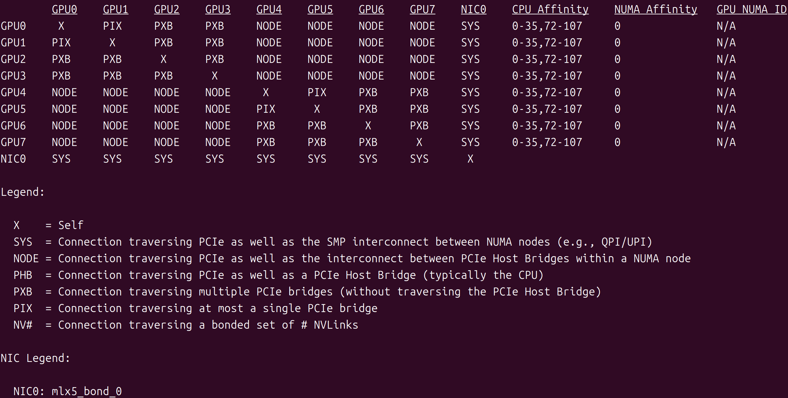
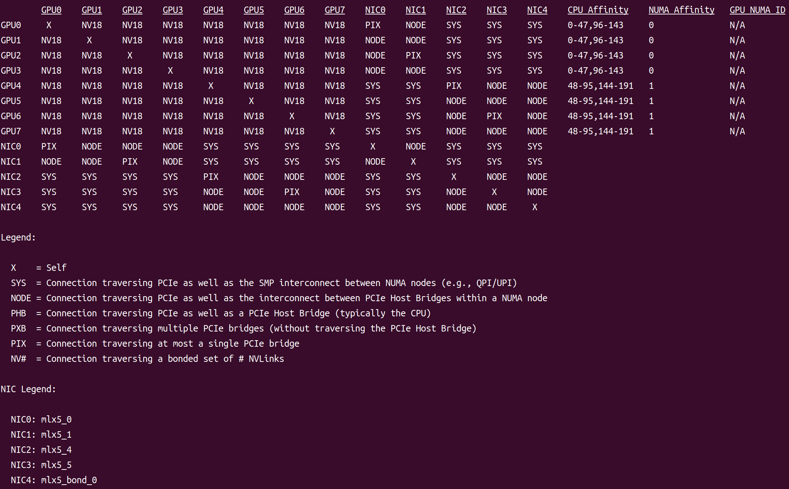
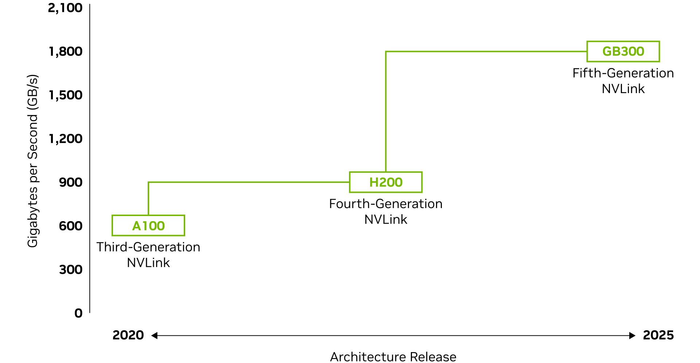

# NvidiaGPU-学习笔记

#### 1：Nvidia GPU架构

| **架构名称**     | **发布时间 / 年份** | **代表产品（示例）**                                         |
| ---------------- | ------------------- | ------------------------------------------------------------ |
| **Blackwell**    | 2024 年 3 月        | GeForce RTX 50 系列（如 RTX 5090/5080/5070）、数据中心 B 系列（B100/B200）、GB200，RTX PRO 6000 Blackwell |
| **Hopper**       | 2022 年 3 月        | H系列，H100、H200、H800                                      |
| **Ada Lovelace** | 2022 年 9 月        | GeForce RTX 40 系列（如 RTX 4090/4080/4070）、专业卡 L40/L40S、RTX 6000 Ada 等 |
| **Ampere**       | 2020                | GeForce RTX 30 系列（RTX 3090/3080…）、NVIDIA A100、RTX A 系列（A40/A30 |
| **Turing**       | 2018                | GeForce RTX 20 系列（RTX 2080/2070…）、GTX 16 系列、Tesla T4、Quadro RTX 系列 |
| **Volta**        | 2017                | Tesla V100、Titan V                                          |
| **Pascal**       | 2016                | GeForce GTX 10 系列（GTX 1080/1070…）、Tesla P 系列、Quadro P 系列 |
| **Maxwell**      | 2014                | GeForce GTX 900 系列（GTX 980/970…）、专业与工作站卡 M 系列  |
| **Kepler**       | 2012                | GeForce GTX 600/700 系列、Tesla K 系列                       |
| **Fermi**        | 2010                | GeForce GTX 400/500 系列、Tesla C/V 系列                     |
| **Tesla**        | 2006                | 早期 Tesla 系列 GPU（如 Tesla C870 等）                      |
| **Curie**        | 2004                | 旧代 GPU 产品（如 GeForce FX 系列可能对应时期）              |
| **Rankine**      | 2003                | 初期 G80/G70 世代 GPU（对应前 GeForce 系列）                 |
| **Kelvin**       | 2001                | 早期 GeForce 256 / GeForce2 时代 GPU 等                      |
| **Celsius**      | 1999                | 对应 NV1/NV3-NV17 等老 GPU 世代                              |

#### 2：Nvidia GPU参数解读

以Ampere系列举例

| 参数                  | GeForce RTX 3090 Ti        | A100 SXM4 80 GB             | A100 PCIe 80 GB           |
| --------------------- | -------------------------- | --------------------------- | ------------------------- |
| 架构                  | Ampere                     | Ampere                      | Ampere                    |
| CUDA核心数            | 10752                      | 6912                        | 6912                      |
| 显存                  | 24GB                       | 80GB                        | 80GB                      |
| 显存类型              | GDDR6X                     | HBM2e                       | HBM2e                     |
| 位宽                  | 384 bit                    | 5120 bit                    | 5120 bit                  |
| Memory Clock          | 1313 MHz 21 Gbps effective | 1593 MHz 3.2 Gbps effective | 1512 MHz 3 Gbps effective |
| 带宽(显存<->GPU 内核) | 1.01 TB/s                  | 2.04TB/s                    | 1.92TB/s                  |
| FP16                  |                            |                             |                           |
| FP32                  |                            |                             |                           |
| FP64                  |                            |                             |                           |
| BF16                  |                            |                             |                           |

A100SXM4带宽计算,其他同理


$$
\text{A100 SXM4 80 GB Memory Bandwidth}=\frac{\text{Memory Bus Width} \times \text{Effective Data Rate}}{8}=\frac{5120 \times 3.2}{8} \text{ GB/s} \approx 2.04 \text{ TB/s}
$$


#### 3：GPU的卡间通信

#### PCIE



```latex
X    = Self
SYS  = Connection traversing PCIe as well as the SMP interconnect between NUMA nodes (e.g., QPI/UPI)
NODE = Connection traversing PCIe as well as the interconnect between PCIe Host Bridges within a NUMA node
PHB  = Connection traversing PCIe as well as a PCIe Host Bridge (typically the CPU)
PXB  = Connection traversing multiple PCIe bridges (without traversing the PCIe Host Bridge)
PIX  = Connection traversing at most a single PCIe bridge
NV#  = Connection traversing a bonded set of # NVLinks
```

| 符号     | 全称/含义                                                    | 大致速度/延迟等级        | 实际走的是哪条路？（通俗解释）                               | 常见场景                                 |
| -------- | ------------------------------------------------------------ | ------------------------ | ------------------------------------------------------------ | ---------------------------------------- |
| **X**    | Self                                                         | 自己（最快）             | 自己跟自己通信，最快（内存拷贝都不用）                       | 对角线，永远是X                          |
| **NV#**  | NVLink (#条链路捆绑)                                         | **最快**（通常远超PCIe） | 专用的高速NVLink线缆，H100/H200/A100 HGX等高端机型常见，带宽可达数百~上千GB/s | 8卡HGX、DGX系统内部GPU间通信             |
| **PIX**  | at most a single PCIe bridge                                 | 非常快（PCIe最佳情况）   | GPU ↔ 只经过**一个**PCIe Switch/桥 → 对方GPU，**不走CPU**，延迟低、带宽高 | 同PCIe Switch下的多张卡                  |
| **PXB**  | multiple PCIe bridges (without the PCIe Host Bridge)         | 快                       | GPU ↔ 经过**好几个**PCIe Switch/桥，但**没经过CPU的PCIe根络（Host Bridge）** | 比较大的PCIe树，但还在同一个CPU下面      |
| **PHB**  | PCIe + PCIe Host Bridge (typically the CPU)                  | 中等                     | GPU ↔ PCIe ↔ **CPU的PCIe根络（Host Bridge）** ↔ PCIe ↔ 对方GPU，**必须经过CPU** | 同一NUMA node内，但不同PCIe根络的卡      |
| **NODE** | PCIe + interconnect between PCIe Host Bridges within NUMA node | 较慢                     | 同NUMA节点内，不同CPU的PCIe Host Bridge之间通过**CPU内部互连**（不太常见） | 比较少见                                 |
| **SYS**  | PCIe + SMP interconnect between NUMA nodes (QPI/UPI/...)     | **最慢**（intra-node）   | 跨NUMA节点，GPU ↔ PCIe ↔ CPU1 ↔ **QPI/UPI/环总线/Ultra Path Interconnect** ↔ CPU2 ↔ PCIe ↔ GPU | 最典型的两路/四路服务器，不同CPU插槽的卡 |


##### NV-Link

**[NVLink](https://www.nvidia.com/en-us/data-center/nvlink/)** 是 NVIDIA 开发的一种高带宽、低延迟的 **GPU-to-GPU 互连（interconnect）技术**，用来让多个 GPU 高效地交换数据。它比传统的 PCIe 通道快得多，适合大规模 AI 训练和高性能计算（HPC）场景。

8*4090


8*H20-141G






|                                 |      Third Generation      |      Fourth Generation      | Fifth Generation              |
| :-----------------------------: | :------------------------: | :-------------------------: | ----------------------------- |
|    NVLink bandwidth per GPU     |          600GB/s           |           900GB/s           | 1,800GB/s                     |
| Maximum Number of Links per GPU |             12             |             18              | 18                            |
| Supported NVIDIA Architectures  | NVIDIA Ampere architecture | NVIDIA Hopper™ architecture | NVIDIA Blackwell architecture |


##### NV-Link-Switch


|                                                              |      NVLink 3 Switch       |       NVLink 4 Switch       |        NVLink 5 Switch        |
| :----------------------------------------------------------: | :------------------------: | :-------------------------: | :---------------------------: |
| Number of GPUs with direct connection within a NVLink domain |          Up to 8           |           Up to 8           |           Up to 576           |
|                NVSwitch GPU-to-GPU bandwidth                 |          600GB/s           |           900GB/s           |           1,800GB/s           |
|                  Total aggregate bandwidth                   |          4.8TB/s           |           7.2TB/s           |             1PB/s             |
|                Supported NVIDIA architectures                | NVIDIA Ampere architecture | NVIDIA Hopper™ architecture | NVIDIA Blackwell architecture |

#### 4：GPU通信实例

##### cuda编程语基础

+ cuda 的"hello,world!"


+ 
+ 


##### nccl


##### nixl


#### 5：


#### 6：


#### 7：参考

1：[维基百科](https://zh.wikipedia.org/zh-hans/%E5%9C%96%E5%BD%A2%E8%99%95%E7%90%86%E5%99%A8)

2：[NV-link](https://www.nvidia.com/en-us/data-center/nvlink/)

3：[youkaichao](https://zhuanlan.zhihu.com/p/692947173)

4：[nccl](https://docs.nvidia.com/deeplearning/nccl/user-guide/docs/env.html)